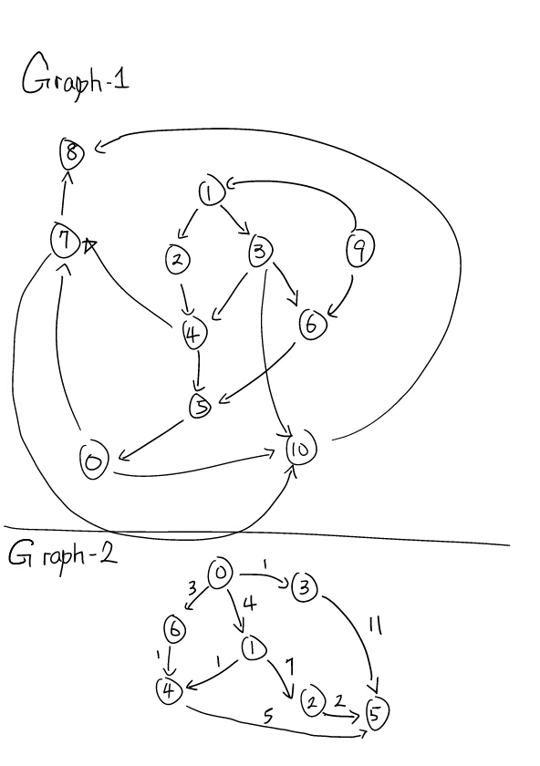
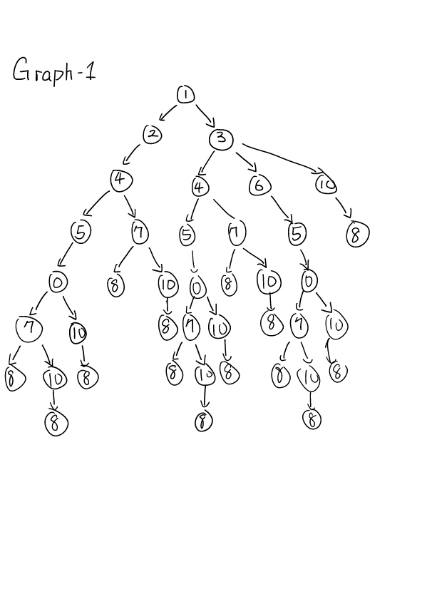

# Important note

Please continue your work on top of `homework 1` in the same repository because you will need code from homework 1 to be working in order to accomplish homework 2. Once you are done with homework 2, you may open another Pull Request.

# Description

**Search**

<<<<<<< HEAD
In this homework, we are going to implement BFS and DFS continue on top of our data structure (Graph) that you implemented in homework 1.

* Being able to find path between two nodes using either BFS or DFS

Here is a quick review of [lessson 2](../notes/general-search.md)
=======
In this homework, we are going to implement all the search strategies under search package (continue on top of our data structure (Graph) that you implemented in homework 1).

* Being able to find path between two nodes using either of the search strategies
>>>>>>> e7f666c295f122a589044ce28a14dd56d2e097cd

**Pictures worth a thousand word**

Below is the graph visualization, you should use this homework description to debug the graph traversal in BFS and DFS.




**Example**

<<<<<<< HEAD
Assume I give a test on BFS and DFS from node 1 to 8, they (BFS and DFS) will generate different result due to the nature of the implementation (one goes by depth and one goes by level).
=======
Assume I give a test on the search strategies from node 1 to 8, they (BFS and DFS) will generate different result due to the nature of the implementation (one goes by depth and one goes by level).
>>>>>>> e7f666c295f122a589044ce28a14dd56d2e097cd

```java
graph.search(BFS(), new Node(1), new Node(8));
graph.search(DFS(), new Node(1), new Node(8));
```

# Tasks

<<<<<<< HEAD
1. Implement BFS and DFS methods in `BFS.java` and `DFS.java`
    1. Helper method `distance(fromNode, toNode)` in `ObjectOriented.java`, `AdjacencyMatrix.java` and `AdjacencyList.java`
=======
1. Implement BFS and DFS methods in `BFS.java`, `DFS.java`, `Dijkstra.java`, `AstarSearch.java`
    1. Helper method `distance(fromNode, toNode)` in `ObjectOriented.java`, `AdjacencyMatrix.java` and `AdjacencyList.java`
2. Implement helper method to solve rectangular search in `Parser.java`
>>>>>>> e7f666c295f122a589044ce28a14dd56d2e097cd
2. Verify implementation via provided unit tests
3. ~~Solve maze escape game~~ (due to the time constraint)

# Deliverable

* Github Pull Requests (be sure to pass all unit tests)

<<<<<<< HEAD
:no_entry_sign: DO NOT MODIFY ANY EXISTING CODES :no_entry_sign:
=======
:no_entry_sign: DO NOT MODIFY ANY EXISTING UNIT TEST OR INTERFACE CODES :no_entry_sign:
>>>>>>> e7f666c295f122a589044ce28a14dd56d2e097cd

> but you can add more methods and variables as you go

# Grading Rubric

<<<<<<< HEAD
* Pass `BFS.java` [5 pts]
    * Pass unit tests [3 pts]
    * Coding style and minor details [2 pts]
* Pass `DFS.java` [4 pts]
    * Pass all unit tests [2 pts]
    * Coding style and minor details [2 pts]
=======
* Pass tests for `BFS.java` [2 pts]
* Pass tests for `DFS.java` [2 pts]
* Pass tests for `Dijkstra.java` [2pts]
* Pass tests for `AstarSearch.java` [3 pts]
>>>>>>> e7f666c295f122a589044ce28a14dd56d2e097cd
* Distance method under `ObjectOriented.java`, `AdjacencyMatrix.java` and `AdjacencyList.java` [1 pts]
